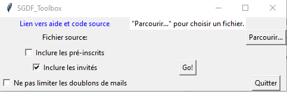
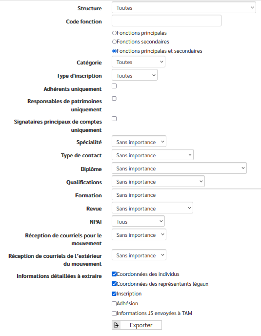
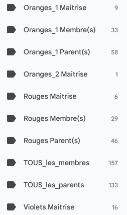

# Interface

# But du programme
A partir de l'extraction des individus de l'intranet scout, ce programme:
1. Export des contacts vers GMAIL: crée un fichier de tous les contacts pour le groupe (+1 par unité). 
1. génère un excel de synthèse avec:
- un onglet contenant tous les contacts du groupe (parents inclus)
- un onlget avec les effectifs par unité (sans les parents)
- des membres du groupe

# Mode d'emploi
## Extraction des données depuis l'intranet SGDF
Dans le menu de l'intranet: 
`pilotage > Extractions > Extraire individus`

Cocher: 
* Fonctions principales et secondaires
* Coordonnées des individus
* Coordonnées des Parents
* Inscription

*Ne pas cocher adhésion* sinon, on n'a pas les invités et les inscriptions non terminées!

Laisser toutes les autres options par défaut. Il est possible d'enregister la configuration.

## utilisation
1. Lancer le programe
1. Selectionner le fichier extrait de l'intranet
1. Définir les options.   Explication de l'option **Ne pas limiter les doublons de mails**: si l'intranet contient le même mail pour le jeune, le papa et la maman, on aura trois contacts avec le même mail. Si décoché, seul le mail de la maman sera exporté.
1. cliquer sur __"Go"__

Le programme crée dans le même dossier:
* des fichiers CSV pour import GMAIL: un fichier CSV pour le groupe et un pour chaque couleur (ex:permet d'importer uniquement les contacts des bleus dans la boite gmail des bleus et tous les contact du groupe dans la boite du groupe)
* un fichier excel pour le groupe avec un onglet par couleur.
* Un fichier xlsx par couleur est aussi généré.

Faire la mise à jour des contacts dans gmail - application contacts. Voir aide de google.
On obtient des labels avec les listes de diffusion pour les matrises, les jeunes et les parents.

Rappel: les données des personnes sont confidentielles et ne doivent pas être partagées (les chefs d'une unité n'ont pas à avoir l'export total du groupe entre les mains); les courriers doivent toujours partir en copie cachée.

# Lancement
Télécharger la dernière version [ici](https://github.com/Fapibo/SGDFToolBox/releases) 
* __Windows uniquement__: Lancement de l'executable avec un double clic
Lancer l'executable en ignorant les avertissements de sécurité de windows  

*note*: L'executable est généré par pyinstaller: `pyinstaller --onefile SGDF_Toolbox.py`

* __tout système__: directement en python
1. installer python 3
1. installer les dépendances avec la commande
`pip3 install -r requirements.txt`
1. lancer le script

# Fichier de configuration "Const.py"
Le fichier de configuration Const.py n'a normalement pas besoin d'être modifié par l'utilisateur.
Il contient (voir les explications directement dans le fichier):
- l'ordre des colonnes dans le fichier importé
- l'ordre des colonnes dans le fichier CSV à générer
- les types de structure à chercher ainsi que leur nom court.  
